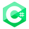

# 😃 Hey There! 👋

Welcome to my profile. 

## 🚀 About Me
🎓  I'm Karan Negi ,pursuing my Bachelors in **Computer Science & Engineering.**

🧑  Few words that defines me are **Tenacious**, **Positive** and **Creative**.

🎸 Enthuastic about learning new technology.

📚 I also love to read books, sketching and sports.

## 🔗 Links

 
 
 
 
 
 
 
 

## 🛠 Skills

  

## ♠️ Status
- I enjoy contributing to **Open Source Projects**.

<!--
**KaranOO/KaranOO** is a ✨ _special_ ✨ repository because its `README.md` (this file) appears on your GitHub profile.

Here are some ideas to get you started:

- 🔭 I’m currently working on ...
- 🌱 I’m currently learning ...
- 👯 I’m looking to collaborate on ...
- 🤔 I’m looking for help with ...
- 💬 Ask me about ...
- 📫 How to reach me: ...
- 😄 Pronouns: ...
- ⚡ Fun fact: ...
-->
