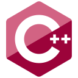

<!-- ### Hi there 👋 -->

# Hi, I'm Karan! 👋

:blush: Welcome to my profile. :smiley: Hey, You know what, lemme tell you a secret... The other day I went to gym.

It was closed down. You know why did the GYM close down? Because it just didn't work out! :rofl:

## 🚀 About Me
I'm a student, pursuing **B.Tech(CSE)** from **KIIT College of Engineering**, Sohna Road.

Few words that defines me are **Tenacious**, **Positive** and **Creative**.

## 🔗 Links

&nbsp;
 
&nbsp;
 
&nbsp;
 
&nbsp;
 

## 🛠 Skills

  

## :spades: Status
- Open for intern or collaboration on any project work.

<!--
**KaranOO/KaranOO** is a ✨ _special_ ✨ repository because its `README.md` (this file) appears on your GitHub profile.

Here are some ideas to get you started:

- 🔭 I’m currently working on ...
- 🌱 I’m currently learning ...
- 👯 I’m looking to collaborate on ...
- 🤔 I’m looking for help with ...
- 💬 Ask me about ...
- 📫 How to reach me: ...
- 😄 Pronouns: ...
- ⚡ Fun fact: ...
-->
